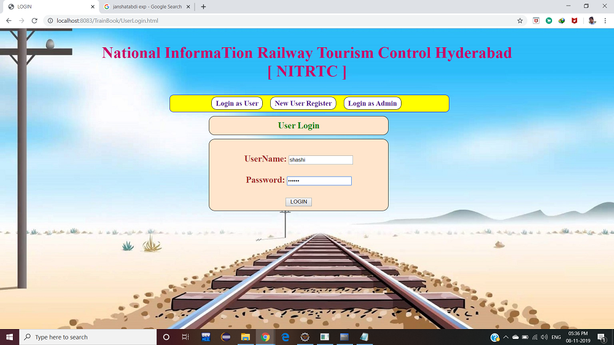
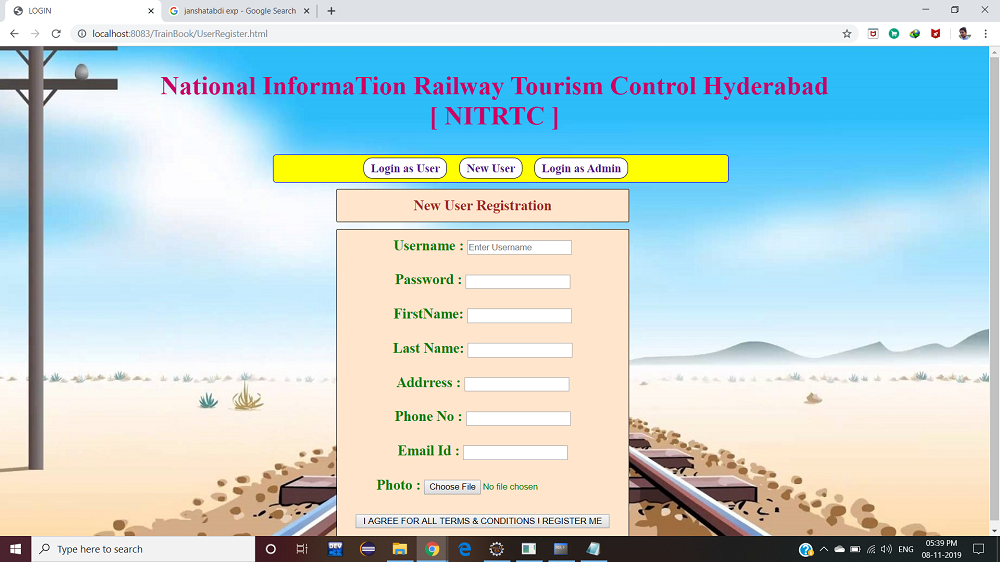
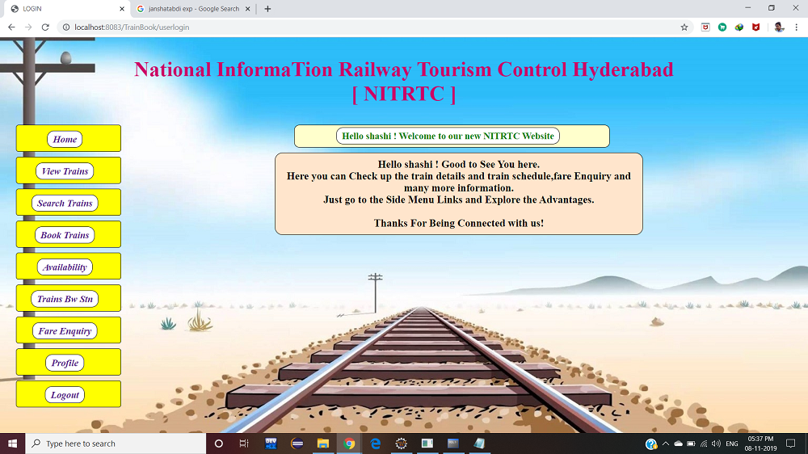
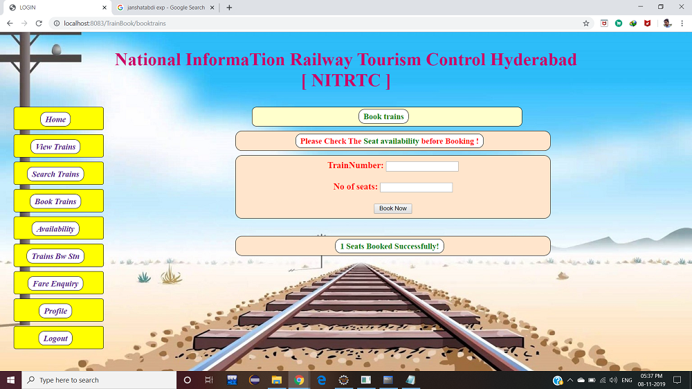
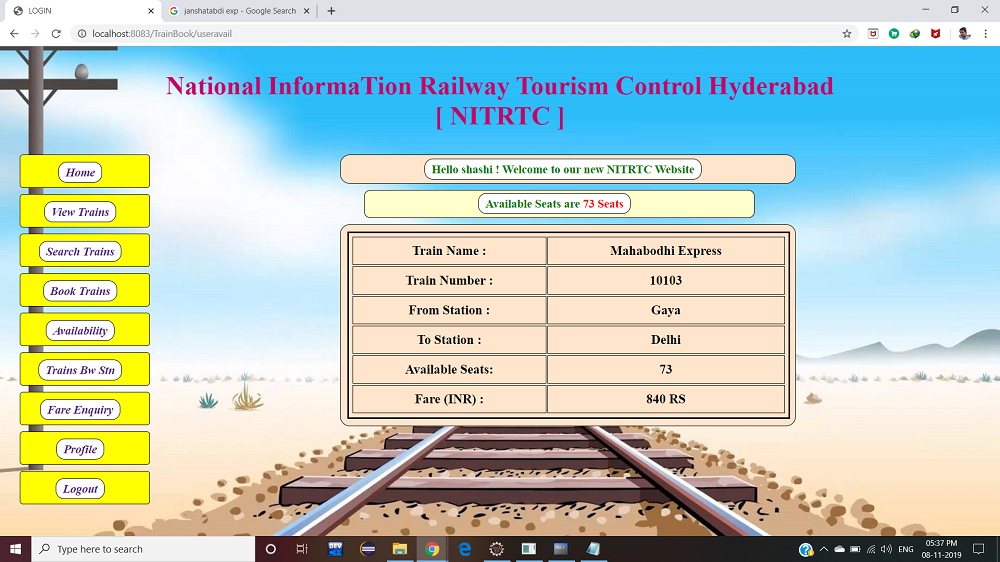
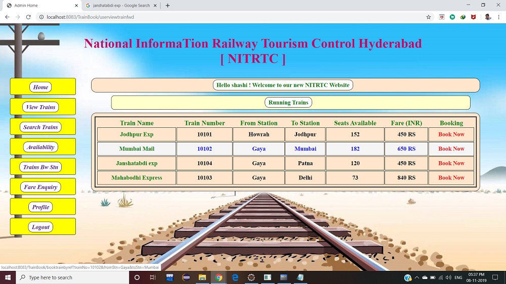
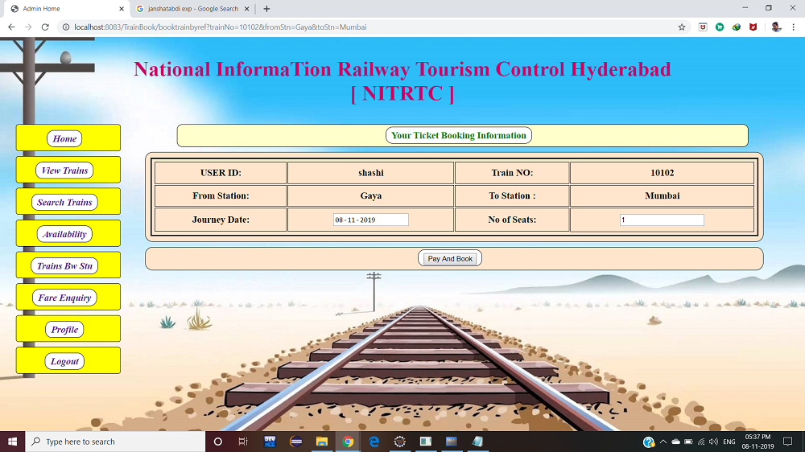
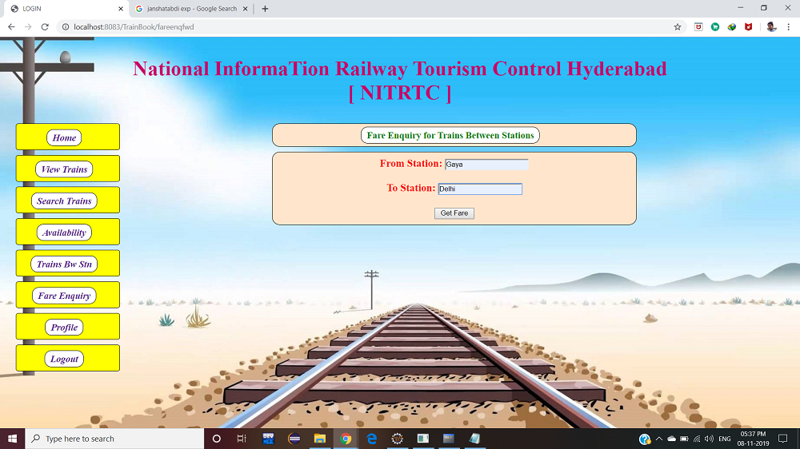
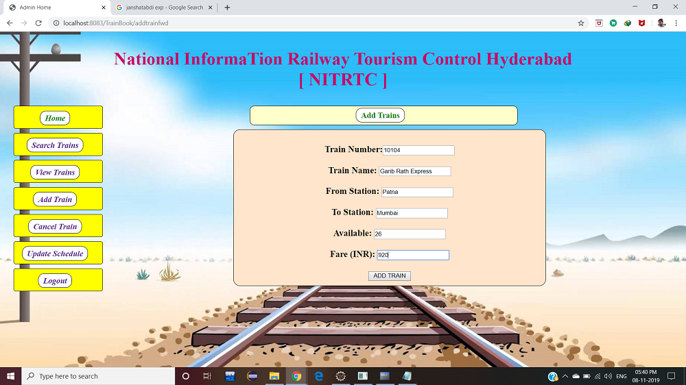
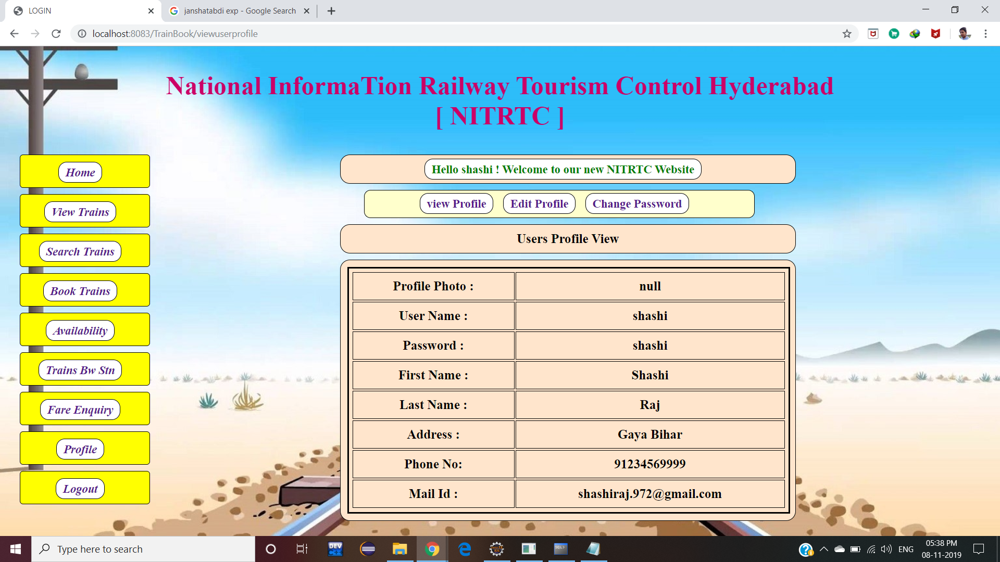

# Train Ticket Reservation System

A complete web-based railway reservation platform built using Java Servlets, JDBC, JSP, and MySQL. The system streamlines ticket reservations, train schedules, route lookups, seat availability checks, and profile management for passengers, alongside operational controls for railway admins.

---

## Features

- **User Authentication**: Secure registration, login, and password reset flows.
- **Train Search & Seat Availability**: Live station-to-station train search with dynamic seat checks.
- **Ticket Booking & PNR Generation**: Multi-passenger booking workflow with automatic fare computation.
- **Profile & Booking History**: View current bookings, ticket history, and account profile details.
- **Admin Dashboard**: Real-time management to schedule and add new trains, routes, and update inventory.

---

## Tech Stack

- **Backend**: Java (Servlets, JDBC)
- **Frontend**: JSP, JSTL, HTML5, CSS3, JavaScript
- **Database**: MySQL
- **Build Tool**: Apache Maven
- **Server Runtime**: Apache Tomcat 9.0+

---

## Application Screenshots

| Feature | Preview |
| :--- | :--- |
| **Login** |  |
| **User Registration** |  |
| **User Dashboard** |  |
| **Train Search** |  |
| **Seat Availability** |  |
| **Book Ticket** |  |
| **Booking Confirmation** |  |
| **Fare Enquiry** |  |
| **Fare Details** |  |
| **Admin - Add Train** |  |
| **User Profile** |  |

---

## Database Setup

1. Open your MySQL client (CLI or Workbench).
2. Execute the setup script from the root directory:
   ```bash
   mysql -u root -p < Dummy-Database.sql
   ```
3. Update your database credentials in `src/main/java/com/ttrs/config/DBConnection.java` if required:
   ```java
   private static final String URL = "jdbc:mysql://localhost:3306/railway_db";
   private static final String USERNAME = "root";
   private static final String PASSWORD = "your_password";
   ```

---

## Installation & Deployment

### Prerequisites
- Java JDK 8 or higher
- Apache Maven 3.6+
- Apache Tomcat 9.0+
- MySQL Server 8.0+

### Build & Run
1. Clone the repository:
   ```bash
   git clone [https://github.com/Srijan264/Train-Ticket-Reservation-System.git](https://github.com/Srijan264/Train-Ticket-Reservation-System.git)
   cd Train-Ticket-Reservation-System
   ```
2. Build the `.war` package using Maven:
   ```bash
   mvn clean package
   ```
3. Deploy to Tomcat:
   - Copy `target/Train-Ticket-Reservation-System.war` to the Tomcat `webapps/` folder.
   - Start Tomcat:
     ```bash
     catalina.sh run
     # Or on Windows:
     startup.bat
     ```
4. Access the web interface at:
   ```
   http://localhost:8080/Train-Ticket-Reservation-System/
   ```
