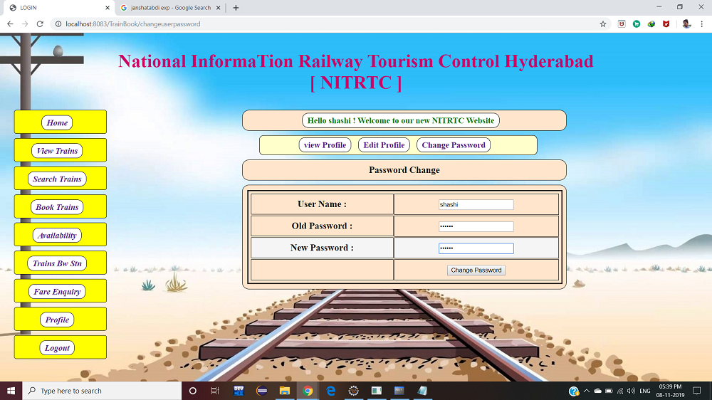

# Train Ticket Reservation System

A full-stack, web-based Train Ticket Reservation System developed using **Java Servlets**, **JSP**, **JDBC**, and **MySQL**. The application provides an integrated platform for users to search trains between stations, check real-time seat availability, inspect fares, and book tickets, while offering administrators complete control over train routes, schedules, and ticket inventories.

---

## Features

### User Module
- **Authentication**: User registration, login, profile view, profile edit, and password change.
- **Search & Availability**: Search trains between stations and view live seat availability.
- **Fare Enquiry**: Check dynamic fare rates across stations.
- **Ticket Booking**: Book tickets with unique transaction IDs and view booking history.
- **Ticket Cancellation**: Cancel tickets with automatic seat restoration.

### Admin Module
- **Train Inventory Management**: Add new trains, update route schedules, and set seat capacity and fares.
- **Monitoring & Cancellation**: Cancel operational routes and search train details.

---

## Tech Stack

- **Backend**: Java 8+, Java Servlets, JDBC
- **Frontend**: JSP, HTML5, CSS3, JavaScript
- **Database**: MySQL 5.7+ / 8.0+
- **Application Server**: Apache Tomcat 8.5+ / 9.0+
- **Build Tool**: Apache Maven

---

## Application Screenshots

### 1. Authentication & Profile
| User Login | User Registration |
| :---: | :---: |
|  |  |

| User Profile | Change Password |
| :---: | :---: |
|  |  |

---

### 2. Dashboard & Train Search
| User Dashboard | Search Trains |
| :---: | :---: |
|  |  |

---

### 3. Availability & Fare Enquiry
| Seat Availability | Fare Enquiry Form |
| :---: | :---: |
|  |  |

| Fare Enquiry Result |
| :---: |
|  |

---

### 4. Booking & Admin Management
| Ticket Booking Form | Booking Confirmation |
| :---: | :---: |
|  |  |

| Add Trains (Admin Panel) |
| :---: |
|  |

---

## Database Setup

1. Open MySQL CLI or MySQL Workbench:
   ```sql
   CREATE DATABASE train_reservation;
   USE train_reservation;
